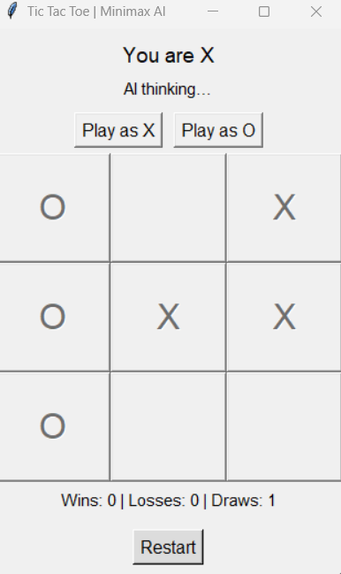

# 🎮 Tic‑Tac‑Toe AI (Minimax + Alpha‑Beta Pruning)

A modular **Tic‑Tac‑Toe** game implemented in Python featuring an intelligent AI opponent powered by the **Minimax algorithm** with **α–β pruning optimization**.

---

## 🧠 Game Logic Overview

The core logic is implemented in **`game_logic.py`**, fully independent of the graphical interface.

**Main components:**
- **Game State Control:** Maintains the board (`3×3` matrix), current turn, and available moves.
- **Win Evaluation:** Detects wins across rows, columns, and diagonals.
- **Minimax Algorithm:** Recursively explores all possible moves to choose the optimal one.
- **α–β Pruning:** Reduces the number of explored branches for faster decisions.
- **Depth Heuristic:** Prefers faster wins and delays inevitable losses.

**Score system:**
| Outcome | Value | Note |
|----------|--------|------|
| Win      | +100   | Faster wins are prioritized (`100 + (10 - depth)`) |
| Loss     | −100   | Slower losses are preferred (`-100 - (10 - depth)`) |
| Draw     | 0      | No advantage |

---

## 🪟 GUI Overview

The graphical interface, defined in **`gui.py`**, is built with **Tkinter** and follows a simplified MVC structure.

**Interface structure:**
- **Header & Turn Indicator** – Displays selected symbol and current status.
- **Symbol Selection** – Buttons allowing player to choose `X` or `O` before the game starts.
- **Game Grid (3×3)** – Interactive buttons reflecting board state.
- **Stats Bar** – Tracks total Wins / Losses / Draws.
- **Restart Button** – Resets the board while keeping cumulative statistics.

Changing the player's symbol is allowed **only before** a new game starts to ensure state consistency.

---

## ⚙️ Project Structure
```bash

│ minimax‑xo‑alpha‑beta	

├── src/

│ ├── game_logic.py # Game functions

│ └── gui.py # Interactive Tkinter GUI 

├── main.py 

├── requirements.txt

└── README.md
```

## 🧩 Setup & Run
```bash
# Install dependencies
pip install -r requirements.txt

# Run the GUI
python main.py
```

## 📘 Future Work
Add multiple difficulty levels (Minimax depth-limited)
Human vs. Human mode
Web version using Flask or Streamlit

## 🧱 Example GUI Layout




---
**Author:** Shantiya  
**License:** MIT  
**GitHub:** [github.com/ShantiyaShamushaki](https://github.com/ShantiyaShamushaki)